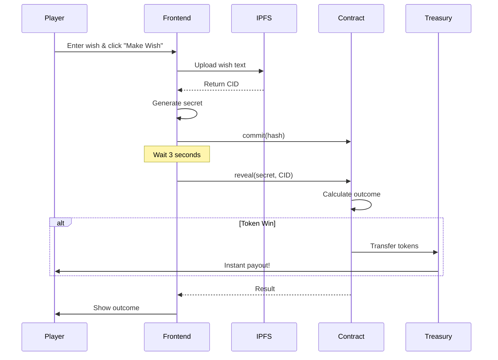

<p align="center">
  
</p>

<h1 align="center">Zoltaran Speaks</h1>

<p align="center">
  <strong>A Fully Decentralized Fortune Teller Game on Proton Blockchain</strong>
</p>

<p align="center">
  <a href="https://github.com/ubitquity/Zoltaran_Speaks/blob/main/LICENSE">
    
  </a>
  <a href="https://protonchain.com/">
    
  </a>
  <a href="https://ipfs.io/">
    
  </a>
  
</p>

<p align="center">
  <a href="#-features">Features</a> •
  <a href="#-how-it-works">How It Works</a> •
  <a href="#-quick-start">Quick Start</a> •
  <a href="#-smart-contract">Smart Contract</a> •
  <a href="#-development">Development</a> •
  <a href="#-security">Security</a>
</p>

---

## 🎰 About

**Zoltaran Speaks** is an arcade-style fortune teller game where players make wishes and receive mystical outcomes. Unlike traditional web games, Zoltaran runs **100% on-chain** with provably fair random number generation and instant token payouts.

> *"Make a wish... if you dare!"* 🔮

### Live Demo
🎮 **Play Now**: [ndao.org/arcade/games/Zoltarano_Speaks](https://ndao.org/arcade/games/Zoltarano_Speaks/)

---

## ✨ Features

<table>
<tr>
<td width="50%">

### 🔗 Fully Decentralized
- No backend servers required
- All game state stored on Proton blockchain
- Wish text stored on IPFS
- Verifiable on block explorer

</td>
<td width="50%">

### 🎲 Provably Fair
- Commit-reveal RNG scheme
- Outcome determined on-chain
- Impossible to manipulate or predict
- Full transparency

</td>
</tr>
<tr>
<td width="50%">

### ⚡ Instant Payouts
- Token rewards paid immediately
- No withdrawal delays
- No payout queues
- Direct to your wallet

</td>
<td width="50%">

### 🪙 Multi-Token Support
- XUSDC, ARCADE, NFTP
- TITLET, UBQTX, UBQT
- NDAO, NDAOX, and more
- Bonus wishes on select tokens

</td>
</tr>
</table>

---

## 🎯 How It Works

### Game Flow



### Outcome Probabilities

| Outcome | Probability | Reward |
|---------|-------------|--------|
| ✨ **Wish Granted** | 20% | Your wish comes true! |
| 🥉 Small Blessing | 10% | 250 $ARCADE |
| 🥈 Medium Fortune | 8% | 500 $ARCADE |
| 🥇 Grand Prophecy | 2% | 1,000 $ARCADE |
| 🎰 Free Spin | 10% | +1 Free Wish |
| 🔄 Try Again | 50% | Better luck next time |

> **House Edge**: 50% — Entertainment purposes only!

---

## 🚀 Quick Start

### Prerequisites

- [WebAuth Wallet](https://webauth.com/) or compatible Proton wallet
- Some tokens for wishes (XUSDC, ARCADE, etc.)
- Modern web browser

### Playing the Game

1. **Connect Wallet** — Click "Connect Wallet" and approve with WebAuth
2. **Get Wishes** — Use your daily free wish or purchase a pack
3. **Make a Wish** — Type your wish and click the mystical button
4. **See Your Fate** — Watch Zoltaran reveal your destiny!

### Token Bonuses

| Token | Bonus |
|-------|-------|
| 💵 XUSDC | +3.5% extra wishes |
| 🕹️ ARCADE | +2% extra wishes |

---

## 📜 Smart Contract

The game runs on a custom EOSIO smart contract deployed on Proton/XPR Network.

### Architecture

```text
┌─────────────────────────────────────────────────────────────┐
│                    zoltaranwish Contract                     │
├─────────────────────────────────────────────────────────────┤
│  Tables                                                      │
│  ├── users        → Balances, stats, free wish tracking     │
│  ├── commits      → Pending commit-reveal wishes            │
│  ├── gamehistory  → All completed game results              │
│  ├── leaderboard  → Top players by wins                     │
│  ├── config       → Game settings & probabilities           │
│  └── tokenprices  → Accepted tokens & bonuses               │
├─────────────────────────────────────────────────────────────┤
│  Actions                                                     │
│  ├── commit       → Submit wish commitment                  │
│  ├── reveal       → Reveal and determine outcome            │
│  ├── on_transfer  → Handle token purchases                  │
│  ├── setconfig    → Admin: Update settings                  │
│  ├── settoken     → Admin: Configure tokens                 │
│  └── cleanup      → Remove expired commits                  │
└─────────────────────────────────────────────────────────────┘
```

### Contract Address

| Network | Account |
|---------|---------|
| Mainnet | `zoltaranwish` |
| Testnet | `zoltartest` |

---

## 🛠️ Development

### Project Structure

```text
Zoltaran_Speaks/
├── index.html              # Complete frontend (HTML/CSS/JS)
├── contracts/
│   ├── zoltaranwish.cpp    # Smart contract source
│   ├── CMakeLists.txt      # CMake build config
│   └── build.sh            # Build script
├── CLAUDE.md               # Development documentation
└── README.md               # This file
```

### Building the Smart Contract

**Requirements**: [EOSIO CDT](https://github.com/EOSIO/eosio.cdt) v1.8+

```bash
# Clone the repository
git clone https://github.com/ubitquity/Zoltaran_Speaks.git
cd Zoltaran_Speaks/contracts

# Build
./build.sh

# Output: zoltaranwish.wasm, zoltaranwish.abi
```

### Deploying to Testnet

```bash
# Deploy contract
cleos -u https://proton-testnet.eosio.online \
  set contract YOUR_ACCOUNT . zoltaranwish.wasm zoltaranwish.abi

# Initialize configuration
cleos push action YOUR_ACCOUNT setconfig \
  '["admin", "tokencreate", "8,ARCADE", 2000, 1000, 800, 200, 1000]' \
  -p YOUR_ACCOUNT

# Add accepted token (XUSDC example)
cleos push action YOUR_ACCOUNT settoken \
  '["6,XUSDC", "xtokens", 100000, 350, true]' \
  -p YOUR_ACCOUNT

# Fund the treasury
cleos push action tokencreate transfer \
  '["admin", "YOUR_ACCOUNT", "100000.00000000 ARCADE", "TREASURY"]' \
  -p admin
```

### Running Frontend Locally

```bash
# Any static file server works
python -m http.server 8000
# or
npx serve .

# Open http://localhost:8000
```

> **Note**: Full gameplay requires a deployed contract on testnet/mainnet.

---

## 🔒 Security

### Provably Fair RNG

The commit-reveal scheme ensures fair, unpredictable outcomes:

1. **Commit Phase**: Player submits `SHA256(secret + ipfs_cid)` — secret is unknown to contract
2. **Block Finality**: Wait for block confirmation
3. **Reveal Phase**: Player reveals secret, contract computes:
   ```text
   outcome = SHA256(secret + tapos_block_prefix + player) % 10000
   ```
4. **Verification**: `tapos_block_prefix` is unknowable at commit time, preventing manipulation

### Additional Protections

| Protection | Description |
|------------|-------------|
| 🚫 Front-running | `tapos_block_prefix` unknown until reveal |
| ⏱️ Commit Expiry | 1 hour timeout, purchased wishes refunded |
| 👤 Single Commit | One pending commit per user |
| 🔐 Treasury | Only contract can execute payouts |
| 📅 Free Wish | Day-based tracking prevents exploits |

---

## 🌐 IPFS Integration

Wish text is stored on decentralized IPFS via [Ubitquity Constellation](https://ubitquityx.com/IPFS_Constellation/docs/):

```json
{
  "wish": "I wish for world peace",
  "timestamp": 1706000000000,
  "game": "zoltaran_speaks",
  "version": "2.0"
}
```

**Gateway**: `https://constellation.ubitquity.io/ipfs/{CID}`

---

## 🎨 Tech Stack

<p align="center">
  
  
  
  
  
  
</p>

---

## 📄 License

This project is licensed under the **MIT License** — see the [LICENSE](LICENSE) file for details.

```text
MIT License

Copyright (c) 2025-2026 UBITQUITY, INC.

Permission is hereby granted, free of charge, to any person obtaining a copy
of this software and associated documentation files (the "Software"), to deal
in the Software without restriction, including without limitation the rights
to use, copy, modify, merge, publish, distribute, sublicense, and/or sell
copies of the Software...
```

---

## 🙏 Acknowledgments

- [nDAO](https://ndao.org) — Airdrop Arcade platform
- [Proton](https://protonchain.com) — Blockchain infrastructure
- [Ubitquity](https://ubitquity.io) — IPFS Constellation hosting
- [WebAuth](https://webauth.com) — Wallet integration

---

## 🔗 Links

<p align="center">
  <a href="https://ndao.org/arcade/games/Zoltarano_Speaks/">
    
  </a>
  <a href="https://ndao.org/arcade">
    
  </a>
  <a href="https://protonscan.io/account/zoltaranwish">
    
  </a>
</p>

---

<p align="center">
  <sub>Built with 🔮 by the nDAO community</sub>
</p>
